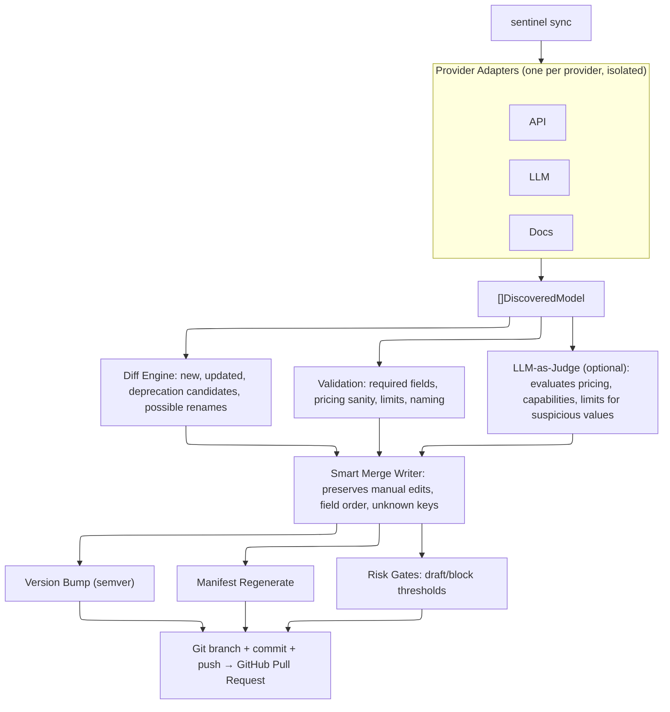

# Sentinel

Sentinel is a Go CLI that discovers AI model metadata from provider APIs, diffs it against a YAML-based model catalog, and opens pull requests with the changes. It runs on a 12-hour cron via GitHub Actions, or manually from the command line.

It exists because maintaining 75+ models across multiple providers by hand does not scale. No existing tool combines scheduled multi-provider discovery with metadata-rich catalog updates (pricing, context windows, capabilities) and risk-gated pull requests.

## How it works



Each provider runs in isolation. If one provider fails, the others still produce their PRs.

## Pipeline steps

1. **Discover** -- Each provider adapter calls its source APIs and returns a list of `DiscoveredModel` structs matching the catalog YAML schema.
2. **Diff** -- Compares discovered models against the existing catalog. Produces a changeset: new models, updated fields, deprecation candidates, and possible renames (heuristic: same family + similar limits/cost).
3. **Validate** -- Checks every model against schema rules: required fields, pricing bounds, limits ranges, filename-to-name consistency. Errors block the PR; warnings appear in the PR body.
4. **Judge** (optional, off by default) -- Sends the changeset to an LLM (Anthropic or OpenAI) to flag suspicious capabilities, pricing, or limits. Non-fatal: if the LLM call fails, the pipeline logs a warning and continues.
5. **Smart merge** -- Writes YAML using `yaml.Node` trees. Overlays discovered fields onto existing files, preserving hand-edited keys, comments, and field ordering. Skips writing if nothing changed.
6. **Version bump** -- MINOR for new models, PATCH for updates only. Never auto-MAJOR.
7. **Manifest** -- Regenerates `manifest.yaml` with provider list, file paths, and aggregate stats.
8. **Risk gates** -- Evaluates the changeset against thresholds. >25 changes, >3 deprecation candidates, or price deltas >35%/2x result in a draft PR. In strict mode, blocked changesets are rejected entirely.
9. **Git + PR** -- Creates a branch (`sentinel/<provider>-<timestamp>`), commits, pushes, and opens a pull request with a markdown summary of all changes.

## Commands

```
sentinel sync                           # full pipeline: discover → diff → validate → write → PR
sentinel sync --dry-run                 # show what would change, don't write or create PRs
sentinel sync --providers=openai        # sync a specific provider only
sentinel diff                           # preview changes, exit code 2 if changes found
sentinel discover --provider=openai     # print discovered models to stdout
sentinel validate --catalog-path=./cat  # validate catalog YAML (CI check)
```

Exit codes: `0` success, `2` changes detected (diff mode), `3` blocked by policy, `4` source health failure.

## Configuration

Copy `config.example.yaml` to `config.yaml`:

```yaml
catalog_path: "../model-catalog"
cache_dir: "~/.cache/sentinel"
cache_ttl: "1h"
providers:
  - openai
sources:
  - api
dry_run: false
risk_mode: "strict" # "strict" or "relaxed"
log_level: "info"

github:
  owner: "your-org"
  repo: "your-catalog-repo"
  base_branch: "main"

openai:
  base_url: "https://api.openai.com/v1"

judge:
  enabled: false
  provider: "anthropic"
  model: "claude-sonnet-4-20250514"
  on_reject: "draft" # "draft" or "exclude"
```

Environment variables override config values with the `SENTINEL_` prefix (e.g., `SENTINEL_CATALOG_PATH`). API keys are set via:

- `GITHUB_TOKEN` -- PR creation and catalog repo access
- `OPENAI_API_KEY` -- OpenAI model discovery
- `ANTHROPIC_API_KEY` -- LLM-as-judge and Anthropic discovery

## Smart merge

The writer does not blindly overwrite model files. For existing models, it loads the current YAML into a node tree, overlays only the fields the adapter has data for, and preserves everything else. A hand-added field like `api_type: responses` survives the next sync run untouched.

New models get a fresh file. In both cases, an `x_updater` block is appended with `last_verified_at` and `sources` metadata -- ignored by catalog consumers.

## Risk gates

| Condition                  | Action    |
| -------------------------- | --------- |
| >25 total changes          | Draft PR  |
| >3 deprecation candidates  | Draft PR  |
| Any price delta >35% or 2x | Draft PR  |
| All clear                  | Normal PR |

In `strict` mode (default), blocked changesets abort the PR for that provider. In `relaxed` mode, they proceed as normal PRs.

## Project structure

```
cmd/sentinel/main.go              CLI entrypoint (all commands)
internal/
  adapter/                        Adapter interface + global registry
    providers/openai/             OpenAI API adapter
    providers/anthropic/          Anthropic API adapter
  cache/                          TTL file cache with ETag support
  catalog/                        Catalog loader, model structs, writer, manifest
  config/                         Viper config with env var bindings
  diff/                           Changeset computation + PR body rendering
  httpclient/                     Rate-limited HTTP client with caching
  judge/                          LLM-as-judge (Anthropic + OpenAI clients)
  pipeline/                       Orchestrator, git ops, GitHub PR creation
  validate/                       Schema validation rules
docs/updater/design.md            Design document
```

## Adding a provider

Create a package at `internal/adapter/providers/<name>/` that implements:

```go
type Adapter interface {
    Name() string
    Discover(ctx context.Context, opts DiscoverOptions) ([]DiscoveredModel, error)
    SupportedSources() []SourceType
}
```

Call `adapter.Register()` in the package's `init()` function, then add the blank import to `cmd/sentinel/main.go`. The adapter self-registers at startup.

See `internal/adapter/providers/openai/` for a complete reference implementation.

## CI/CD

Two GitHub Actions workflows:

- **ci.yml** -- Runs on push/PR to `main`. Builds, tests (`go test ./...`), and lints (`golangci-lint`).
- **sync.yml** -- Runs every 12 hours (6am and 6pm UTC). Checks out sentinel and the catalog repo, builds, and runs `sentinel sync`. Also supports `workflow_dispatch` for manual triggers with optional provider filtering and dry-run.

## Development

```bash
make build       # build binary to bin/sentinel
make test        # go test ./...
make lint        # golangci-lint run ./...
make discover    # run discovery for openai
make diff        # preview changes
make sync        # dry-run sync
make validate    # validate catalog
```

Requires Go 1.23+.

## License

See [LICENSE](LICENSE).
