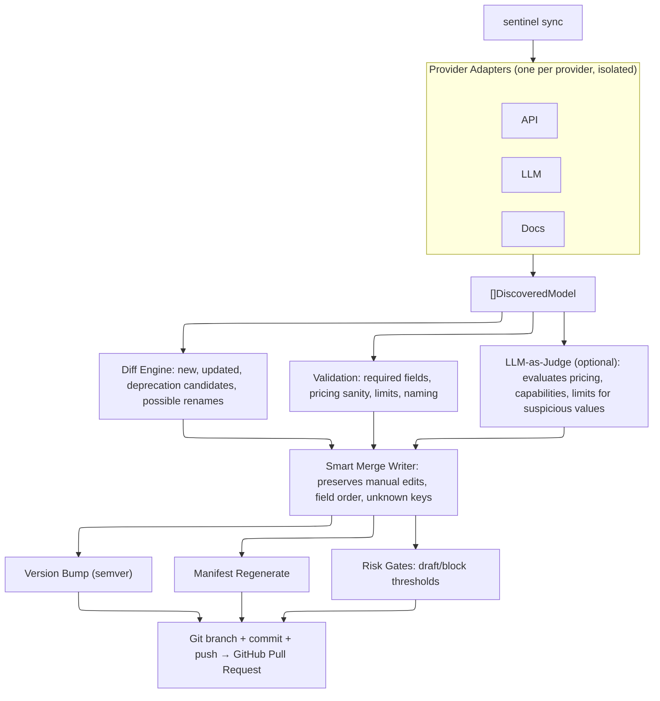

<p align="center">
  
</p>

<h1 align="center">Sentinel</h1>

<p align="center">
  <strong>Keeps your AI model catalog in sync with reality.</strong><br/>
  An open-source tool that discovers AI models from provider APIs<br/>
  and opens PRs to keep your catalog up to date.
</p>

<p align="center">
  <a href="LICENSE">
    
  </a>
  <a href="https://github.com/everstacklabs/sentinel">
    
  </a>
</p>

<p align="center">
  <a href="#how-it-works">How It Works</a> &middot;
  <a href="#commands">Commands</a> &middot;
  <a href="#configuration">Configuration</a> &middot;
  <a href="docs/guide.md">Guide</a> &middot;
  <a href="#adding-a-provider">Adding a Provider</a> &middot;
  <a href="#development">Development</a>
</p>

---

## The Problem

Maintaining 1000+ AI models across multiple providers by hand does not scale. Pricing changes, new models appear, context windows get updated, capabilities shift -- and nobody notices until something breaks. No existing tool combines scheduled multi-provider discovery with metadata-rich catalog updates (pricing, context windows, capabilities) and risk-gated pull requests.

Sentinel automates the entire loop: discover what changed, diff it against the catalog, validate the data, and open a PR for human review.

---

## How it works



Each provider runs in isolation. If one provider fails, the others still produce their PRs.

### Pipeline

| Step | What happens |
|---|---|
| **Discover** | Provider adapters call source APIs, return `[]DiscoveredModel` matching the catalog YAML schema |
| **Diff** | Compares discovered models against existing catalog. Produces changeset: new, updated, deprecation candidates, possible renames |
| **Validate** | Schema rules: required fields, pricing bounds, limits ranges, filename-to-name consistency. Errors block the PR |
| **Judge** | Optional. Sends changeset to an LLM to flag suspicious values. Non-fatal: failures log a warning and continue |
| **Smart merge** | Writes YAML via `yaml.Node` trees. Overlays discovered fields, preserves hand-edited keys and field ordering |
| **Version bump** | MINOR for new models, PATCH for updates only. Never auto-MAJOR |
| **Manifest** | Regenerates `manifest.yaml` with provider list, file paths, aggregate stats |
| **Risk gates** | >25 changes, >3 deprecation candidates, or price deltas >35%/2x trigger draft PRs |
| **Git + PR** | Branch (`sentinel/<provider>-<timestamp>`), commit, push, open PR with markdown summary |

---

## Commands

```
sentinel sync                           # full pipeline: discover → diff → validate → write → PR
sentinel sync --dry-run                 # show what would change, don't write or create PRs
sentinel sync --providers=openai        # sync a specific provider only
sentinel diff                           # preview changes, exit code 2 if changes found
sentinel discover --provider=openai     # print discovered models to stdout
sentinel validate --catalog-path=./cat  # validate catalog YAML (CI check)
```

| Exit code | Meaning |
|---|---|
| `0` | Success / no changes |
| `2` | Changes detected (diff mode) |
| `3` | Blocked by policy |
| `4` | Source health failure |

---

## Configuration

Copy `config.example.yaml` to `config.yaml`:

```yaml
catalog_path: "../model-catalog"
cache_dir: "~/.cache/sentinel"
cache_ttl: "1h"
providers:
  - openai
sources:
  - api
dry_run: false
risk_mode: "strict" # "strict" or "relaxed"
log_level: "info"

github:
  owner: "your-org"
  repo: "your-catalog-repo"
  base_branch: "main"

openai:
  base_url: "https://api.openai.com/v1"

judge:
  enabled: false
  provider: "anthropic"
  model: "claude-sonnet-4-20250514"
  on_reject: "draft" # "draft" or "exclude"
```

All config keys can be overridden via environment variables with the `SENTINEL_` prefix (e.g., `SENTINEL_CATALOG_PATH`).

| Variable | Purpose |
|---|---|
| `GITHUB_TOKEN` | PR creation and catalog repo access |
| `OPENAI_API_KEY` | OpenAI model discovery |
| `ANTHROPIC_API_KEY` | LLM-as-judge and Anthropic discovery |

---

## Smart merge

The writer does not blindly overwrite model files. For existing models, it loads the current YAML into a node tree, overlays only the fields the adapter has data for, and preserves everything else. A hand-added field like `api_type: responses` survives the next sync run untouched.

New models get a fresh file. In both cases, an `x_updater` block is appended with `last_verified_at` and `sources` metadata -- ignored by catalog consumers.

---

## Risk gates

| Condition | Action |
|---|---|
| >25 total changes | Draft PR |
| >3 deprecation candidates | Draft PR |
| Any price delta >35% or 2x | Draft PR |
| All clear | Normal PR |

In `strict` mode (default), blocked changesets abort the PR for that provider. In `relaxed` mode, they proceed as normal PRs.

---

## Project structure

```
cmd/sentinel/main.go              CLI entrypoint (all commands)
internal/
  adapter/                        Adapter interface + global registry
    providers/openai/             OpenAI API adapter
    providers/anthropic/          Anthropic API adapter
  cache/                          TTL file cache with ETag support
  catalog/                        Catalog loader, model structs, writer, manifest
  config/                         Viper config with env var bindings
  diff/                           Changeset computation + PR body rendering
  httpclient/                     Rate-limited HTTP client with caching
  judge/                          LLM-as-judge (Anthropic + OpenAI clients)
  pipeline/                       Orchestrator, git ops, GitHub PR creation
  validate/                       Schema validation rules
docs/updater/design.md            Design document
```

---

## Adding a provider

Create a package at `internal/adapter/providers/<name>/` that implements:

```go
type Adapter interface {
    Name() string
    Discover(ctx context.Context, opts DiscoverOptions) ([]DiscoveredModel, error)
    SupportedSources() []SourceType
}
```

Call `adapter.Register()` in the package's `init()` function, then add the blank import to `cmd/sentinel/main.go`. The adapter self-registers at startup.

See `internal/adapter/providers/openai/` for a complete reference implementation.

---

## CI/CD

| Workflow | Trigger | What it does |
|---|---|---|
| `ci.yml` | Push/PR to `main` | Build, test (`go test ./...`), lint (`golangci-lint`) |
| `sync.yml` | Every 12h (6am/6pm UTC) + `workflow_dispatch` | Checkout sentinel + catalog repo, build, run `sentinel sync` |

---

## Development

```bash
make build       # build binary to bin/sentinel
make test        # go test ./...
make lint        # golangci-lint run ./...
make discover    # run discovery for openai
make diff        # preview changes
make sync        # dry-run sync
make validate    # validate catalog
```

Requires Go 1.26+.

---

## Tech Stack

| Dependency | Purpose |
|---|---|
| Cobra + Viper | CLI framework + config |
| go-git/v5 | Git operations (in-process) |
| go-github/v60 | GitHub PR creation |
| yaml.v3 | YAML read/write with node-level control |
| x/time/rate | HTTP rate limiting |
| x/oauth2 | GitHub token auth |

---

## License

This project is licensed under the [MIT License](LICENSE).
